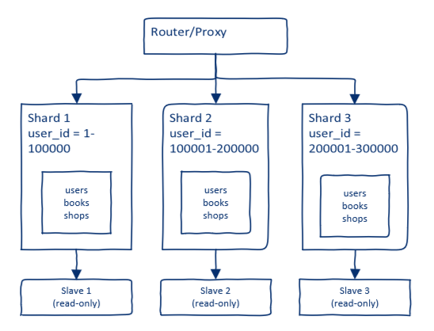

# Домашнее задание к занятию "`Репликация и масштабирование. Часть 2`" - `Борзенко Андрея`

### Задание 1

Активный master-сервер и пассивный репликационный slave-сервер:

- если мастер выходит из строя, можно переключиться на слейв;
- мастер занимается записью, а слейв отдаёт данные на чтение, что снижает нагрузку на мастер;
- бекапы можно делать со слейва, не нагружая основной сервер.

master-сервера и несколько slave-серверов:

- чем больше слейвов, тем больше параллельных запросов на чтение может обработать система;
- падении одного слейва, остальные продолжают работать;
- запросы на чтение можно распределять между слейвами балансировщиком.

---

### Задание 2

Построение системы

Горизонтальный шардинг

Ключ шардирования - user_id

Диапазоны значений:

Shard 1: user_id = 1-100000;

Shard 2: user_id = 100001-200000;

Shard 3: user_id = 200001-300000.

Все таблицы, связанные с пользователем, хранятся в одном шарде:

users - данные пользователя;

books - книги пользователя;

shops - магазины пользователя.

Router/Proxy:
- определяет user_id в запросе;
- вычисляет номер шарда;
- направляет запрос на нужный шард.

Режимы работы:

Master-серверы (Shard 1, 2, 3): Active-Master, принимает запись и чтение, операции: [INSERT, UPDATE, DELETE, SELECT], каждый мастер отвечает только за свой диапазон user_id.

Slave-серверы (Slave 1, 2, 3): Read-Only, операции: [SELECT], Реплицируется со своего master.